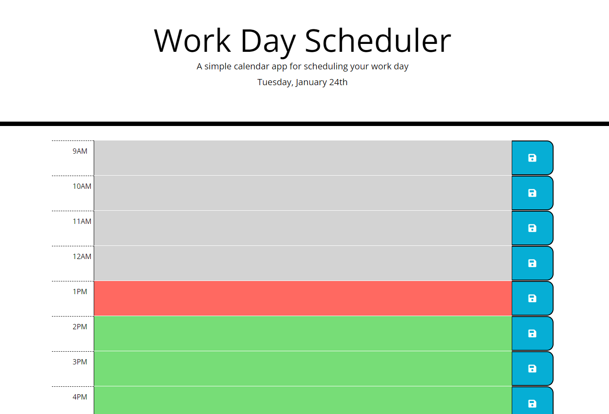

<!-- Improved compatibility of back to top link: See: https://github.com/othneildrew/Best-README-Template/pull/73 -->

<!--
*** Thanks for checking out the Best-README-Template. If you have a suggestion
*** that would make this better, please fork the repo and create a pull request
*** or simply open an issue with the tag "enhancement".
*** Don't forget to give the project a star!
*** Thanks again! Now go create something AMAZING! :D
-->
 

# Work Day Scheduler

<!-- ABOUT THE PROJECT -->
## About The Project
 

This is a simple workday scheduler, built using Bootstrap and the Javascript jquery and Moment libraries. It keeps track of events for a typical 9 to 5 workday. An event can be assigned to each hour and saved, after which it will persist between refreshes. Time blocks are color coded according to the current time, and the current day is displayed at the top of the page.

  

## Installation

N/A

<!-- USAGE EXAMPLES -->
## Usage

Follow this link to the deployed page:

https://guilhfreitas.github.io/guilh-workdayplanner/

Click on the text area beside the hour column to start typing an event. Click on the save button to the right of the text area to save that event. Time blocks are color coded - gray blocks are past, green blocks are still open, and the red block is the current hour.

<!-- ACKNOWLEDGMENTS -->
## Acknowledgments

* [Best README Template](https://github.com/othneildrew/Best-README-Template/pull/73)
